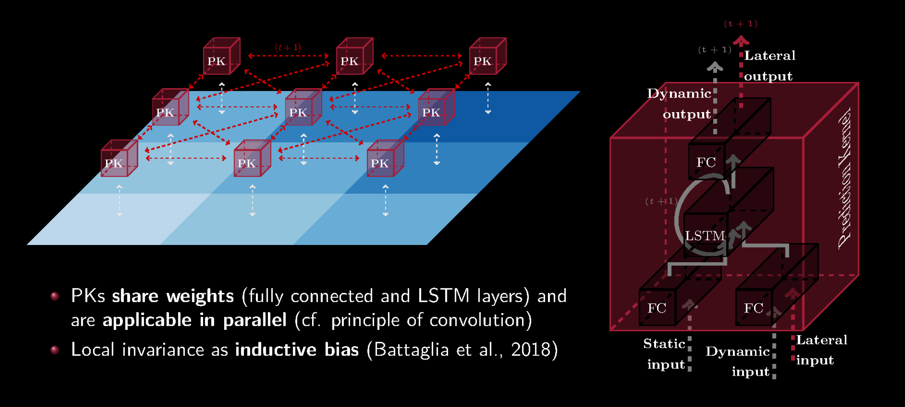

# DISTANA Implementation by Lars Gehrke
This is the repository for Lars Gehrke writing his master's thesis about implementing DISTANA in a parallelized fashion on the GPU to accelerate the training and the testing.
The code is based on the former implementation of Matthias Karlbauer (*code_archive/model/distana*).

## DISTANA - design idea and functional principle by Karlbauer


[Source: Karlbauer's talk 2020 about DISTANA](https://www.youtube.com/watch?v=63GI1ZOsumg&t=53s)

## code folder
The code for the DISTANA implementation. Every use case (generate data, training, testing, run unit test) has its own executable script at the highest level of this folder structure. These top-level scripts work as controller in a model-view-controller fashion by reasonably combining the scripts of the different subfolders.

+ **config** The whole parameter management and the argument parsing from the command line is done here. For the data generation and the training/testing of DISTANA there are two different scripts which are subclasses of _params.py_. All the parameters are automatically loaded from a binary file and can be edited and saved via command line arguments. By choosing the configuration file name "default", you can overwrite the default settings. These binary configuration files are unversioned (.gitignore: \*.pkl). Thus you can have different parameters for different execution environments (server, local) and easily change them via command line.
  + **data_generation_params** [unversioned] In this folder the default and custom parameter dictionaries for the data generation are saved as binary files. 
  + **distana_params** [unversioned] In this folder the default and custom parameter dictionaries for DISTANA are saved as binary files. 

+ **diagram** [unversioned] By choosing to save the diagrams from test.py, this folder will be created automatically and all diagrams from the test run will be saved here.

+ **diagram_gpu** Not important, can be deleted. This folder was just used to access the diagrams from the server. 

+ **model** The different implementations of DISTANA are collected here. Each version has its own subfolder. The facade defines the function signatures that every version must implement and it selects the version specified by the parameters at runtime. 
*abstract_evaluator* is a super class for different versions. 
[Object-oriented programming (OOP) can be a curse or a blessing: OOP has of course many benefits, e.g. better readability, better maintainability, better expandability etc. but Python is a slow programming language and has no strong support of oop approaches. The outsourcing of code segments that are called per batch/sample or even per time step should be done as little as possible.]
  + **old** [No batch; stacked lateral output] 

    Basically Karlbauer's implementation embedded in this code framework. This implementation can only process the data files per sample  (batch size = 1) and each PK produce an individual lateral output for every outgoing connection. 
    
  + **old2** [No batch; single lateral output] 
  
    As *old*, but each PK produce only one lateral output for all outgoing connections.
    
  + **v1a** [batch processing; stacked lateral output] 
  
    Based on *old*, but this implementation can process the samples of one batch (with arbitrary batch size) in parallel. The Prediction Kernel is implemented as a custom PyTorch class in Python with the usage of tensor operations realising the nn layers (fc, lstm, fc). In the last iteration of an epoch the batch size will probably not fit the rest of the data samples. In this case the weight tensors are automatically adapted for this last iteration with a special batch size (amount of remaining samples).
    
  + **v1b** [batch processing; single lateral output] 
  
    As *v1a*, but each PK produce only one lateral output for all outgoing connections.
    
  + **v2** [batch processing; single lateral output; hard coded lateral connections in CUDA] 
  
    As *v1b*, but with a custom CUDA kernel that is implementing the lateral flow between the PKs at the beginning of each time step. However, in this CUDA kernel the grid structure where each PK is laterally connected with up to 8 surrounding neighbors (cf. https://arxiv.org/pdf/1912.11141.pdf) is hard coded. 
    
  + **v3** [batch processing; single lateral output; flexible lateral connections in CUDA] 
  
    As *v2*, but instead of using a CUDA kernel that is hard coding the lateral connections, the CUDA kernel processes adjacency lists that define the lateral connections. The adjacency lists are created in Python and passed as a static value to the CUDA code. 

+ **qa** Quality assurance (qa). Folder for all unit tests. The execution of these unit tests should be selected by calling unit_test.py with the specific command line argument.

+ **tools** To not overstructure the code, all specific code sections that are worth outsourcing are collected here, e.g. code sections responsible for persistence, pytorch specific or view specific issues.


## code archive folder
+ **code_archive/model/distana** former implementation by Karlbauer
+ __code_archive/model/distana\_*__ first steps of code adaption

+ **code_archive/others/extension-cpp** this is the code from the [original PyTorch CUSTOM C++ AND CUDA EXTENSIONS exampel](https://pytorch.org/tutorials/advanced/cpp_extension.html)

  + this is the main resource to implement a custom CUDA kernel for your PyTorch program. Note that there is a plain PyTorch implementation (/python), a C++ implementation (/cpp) and a CUDA implementation (/cuda) of the same custom module! As the tutorial suggests, if you can program your model in plain PyTorch, it should be fine most of the time. PyTorch uses there own very fast CUDA kernels for tensor operations, so there is no need to write your own CUDA kernel most of the time.

+ **code_archive/others/extension-cpp-dev** slightly updated/changed version, to analyse (deprecated) original code and make it work on the server

## Getting started
After cloning this repository, 
```
git clone ...
```
navigate into the code folder.
```
cd code
```
Now we want to generate the 2-dimensional wave data. 
You can check the possible options with the -h argument.
```
python generate_data.py -h
```
Lets say we want to create a training data set with 100 files and a sequence length of 150. The training data should be saved in the data subfolder *my_data*.
```
python generate_data.py save -d train -n my_data -f 100 -t 150
```

In the same way we create a validation and a test data set with 20 files in *my_data*.
```
python generate_data.py save -d val -n my_data -f 20 -t 150
python generate_data.py save -d test -n my_data -f 20 -t 150
```
For the train and test script you can also check the options with the -h argument, but be warned, the list of options may be long.
```
python train.py -h
```

Now we can train model v1b with our data in *my_data*, a batch size for training of 1, a batch size for validation of 100 and 20 epochs on the CPU. (If you have more data, then of course you can increase the batch size and see how it will affect the training performance. But for now we just want to have a decent amount of weight updates per epoch)
If you want to see all parameter values currently used for the execution, you can print out the full list by just adding the --verbose tag.

```
python train.py -m v1b -d my_data -b 1 -v 100 -e 20 -g False
```
This will take some time.

Likewise we could have done the training on the GPU:

```
python train.py -m v1b -d my_data -b 1 -v 100 -e 20 -g True
```

Because the default parameter value for saving the model is true, we can test now the learned behavior on the CPU with a batch size of 20.

```
python test.py -m v1b -d my_data -b 20 -g False
```
In this loop you can press as many '1's as you want. Every 1 will result in another diagram saved to *code/diagram*.

## Parameter management
Instead of editing a file each time you want to change the parameters, you can use the command line (cl) interface of changing the parameters. 
When you want to add a new parameter for DISTANA or change the initial default values of the parameters you can do that in *config/distana_params.py*.
The drawback is, that when you change the initial parameter dictionary, you need to delete the config files in *config/distana_params/\*.pkl* on all devices and you should update the cl interface in *config/distana_params.py*.
Note that the *init_values* dictionary is only specifying the initial default values, when there is no *default.pkl* file in *config/distana_params/*. If there is a *default.pkl* file, the *init_values* dictionary will be ignored and the default parameters will be loaded from file.

If you are on the server and want to have gpu execution enabled by default, then you can do the following:
```
python train.py -g True --save-params default
```
In this way the default file will be overwritten with the temporary parameter configuration.

You can also save a specifc configuration in a separate file (without overwriting the default values)
```
python train.py -m v1b -e 10 -s 100 -g True --save-params my_usecase
```
and use it later
```
python train.py -p my_usecase
```
If you want to reset the (maybe overwritten) default parameter values in *default.pkl* with the *init_values* dictionary, 

then you can use *-r*
```
python train.py -r
```
To list all parameters, you can add *--verbose* at the end
```
python train.py --verbose
```
and to get see full information about the cl interface, you can use the *-h* or the *--help* tag
```
python train.py -h
```

## Further notes
Only because the command line interface offers you the ability to change all the parameters, you should be very aware of what you change! The command line arguments are just a representation of all parameters used in the code. They heavily dependend on the existing data. 
In fact, for now it cannot be guaranteed that all parameter configurations will work well. Not all possible configurations were tested yet.
Note that with model saving enabled and continue training disabled by default, any training progress of the past will be automatically overwritten.

To get the diagrams from the server to my local machine I did the following on the server after *python test.py*:
```
rm -rf gpu_diagrams
mv diagrams gpu_diagrams
git add gpu_diagrams/
git commit -m "gpu diagrams ..."
git push
```
and on my local machine just a *git pull*.

This may not be the best way, but it did the job.

